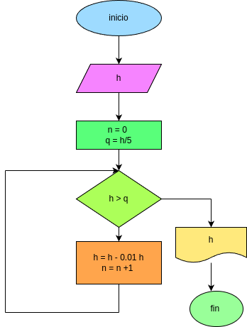

# EJERCICIO 4 - rebote de una pelota 

# Descripcion 
- una pelota deja de caer desde una altura inicial h.
en cada rebote la pelota alcanza una altura de 10% menor que la del rebote anterior 

el programa debe leer la altura inicial y calcular en que rebote la pelota deja de alcanzar la quinta parte de la altura inicial 

## funcionamiento 
1. El usuario ingresa la altura inicial 
2. Se calcula la quinta parte de esa altura 
3. En cada rebote la altura nueva es del 90% de la anterior 
4. El proceso se repite usando un ciclo while 
5. Cuando la altura es menor que la quinta parte de la inicial, el programa muestra el numero de rebote

