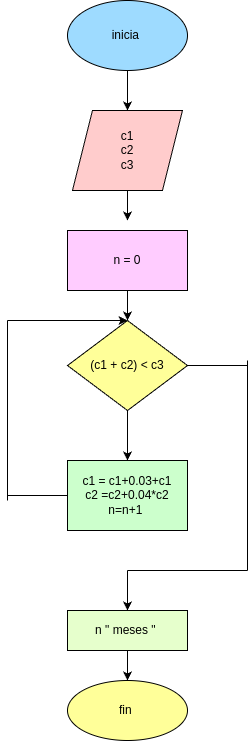

# interes compuesto pedro y juan 

este programa calcula en cuantos meses pedro y juan podran reunir el dinero para un negocio

pedro invierte su dinero con un interes compuesto del 3% mensual
juan invierte si dinero con intereses compuesto de 4% mensual 

el programa pide: 
- capital inicial de pedro (c1) 
- capital inicial de juan (c2)
- capital necesaria para el negocio (c3)

cada mes los capitales crecen con su interes correspondiente hasta que la suma de ambos sea suficiente para iniciar en el negocio 

el programa imprime: 
- numero de meses necesarios 
- capital final de pedro 
- capital final de juan 
- capital total

